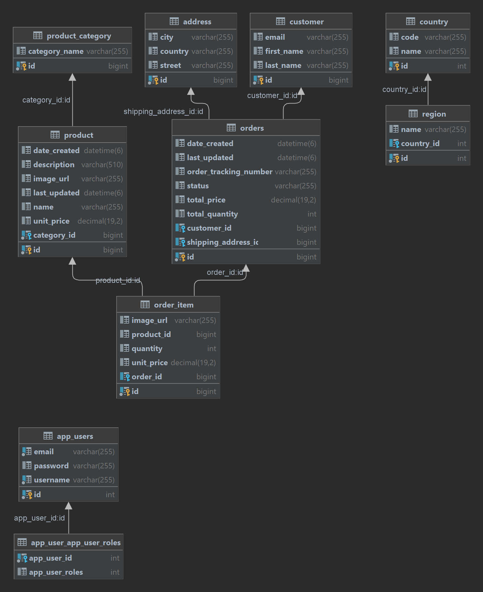
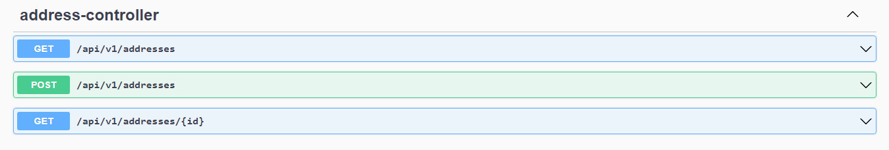
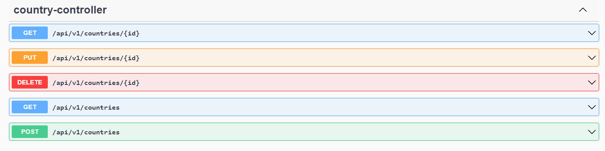
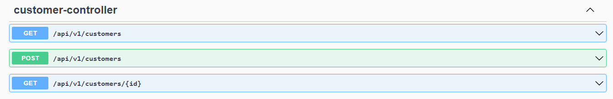
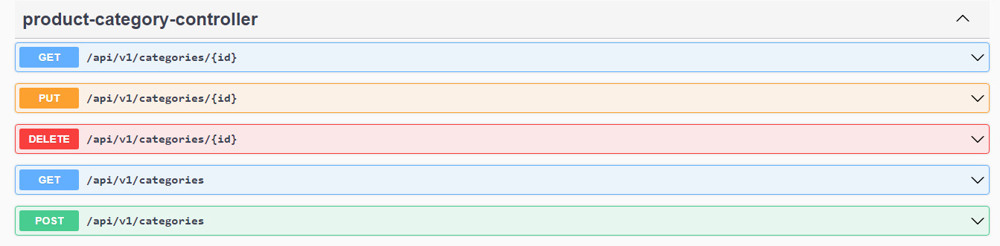
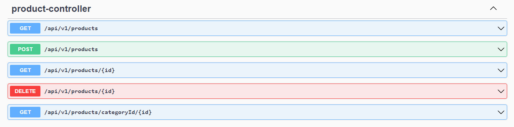
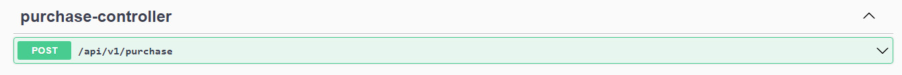
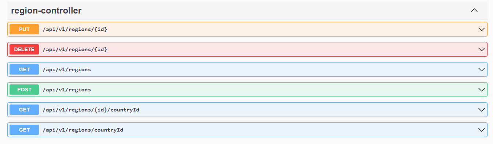
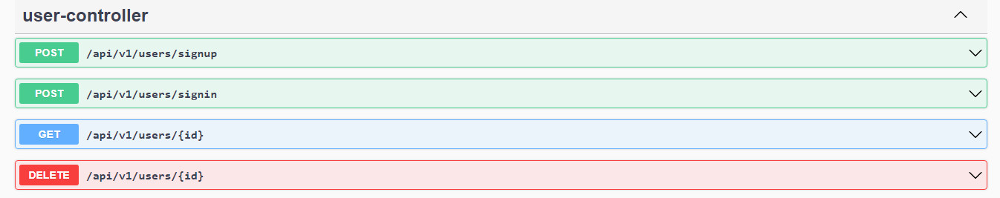

# Rozetka-Online-Store-Backend-Application

Online Shopping System has been developed on Java, Spring Boot and MySQL Database. There are two types of users available in the project. One is a client who can search and buy the products and the second one is an admin who can manage the products. After making a purchase, the client receives an order number.
___

## Features:
a REST API
b Order process
Categories
Pagination
Dynamic search

___

## Technology
Java 18
Spring Boot 2.6.10
MySQL
Spring Security (JWT auth)
Querydsl
ModelMapper
Maven

___

## Database Schema

___

## Swagger

